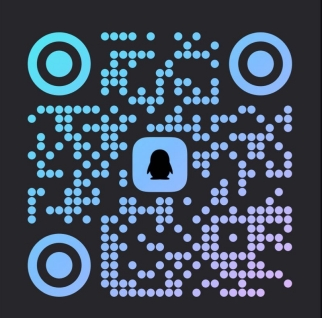

# AI 视频本地化与配音工作流系统

> 一款基于 AI 的视频本地化工作流引擎，用于视频翻译、字幕优化、AI 配音与自动化合成。

---

IMPORTANT: 请先阅读项目的使用说明与软件下载文档：

- 使用说明（使用教程、功能详解与配置）：[点击查看使用说明](doc/usage.md)
- 软件与安装包下载信息：[点击查看软件下载信息](software/softDownload.md)

这两个文档包含了如何获取软件、安装、申请许可证、配置 TTS/翻译服务以及常见问题的详细步骤。开始使用本项目前请务必先查看它们。

---

## 📌 项目简介

本项目是一套 **AI 驱动的视频本地化与二次创作工作流系统**，面向内容创作者、工作室及企业团队，帮助用户高效完成多语言视频的翻译、配音与��[...]  

系统通过工作流方式串联：
- 语音识别（ASR）
- 大模型字幕理解与改写
- AI 语音合成（TTS）
- 音视频时间轴对齐与合成

强调 **高质量、本地化表达、批量处理能力与可扩展架构**。

---

## 📁 项目目录结构

```
autoDub/
├── doc/              # 软件的使用说明文档及其他文档
├── software/         # 软件的压缩包
├── resource/         # 静态资源文件
└── README.md         # 项目说明文档
```

---

## 🖼️ 演示示例

> 请查看B站账号：👉 [点击这里查看演示视频](https://space.bilibili.com/3690994058922220?spm_id_from=333.1007.0.0)

## 🗺️ 未来规划

- [x] 2026.2.15上传工具  
- [ ] 更多语言与音色支持  
- [ ] 二创功能及其他功能支持  
    
## 🚀 核心功能

### 🎙️ 语音识别（ASR）
- 支持长视频语音识别  
- 多语言输入支持  
- 稳定的时间轴输出  

### 🧠 智能字幕优化
- 基于大模型的上下文理解  
- 字幕口语化、剧情化、本地化改写  
- 保留原视频语气与情绪  

### 🗣️ AI 配音（TTS）
- 多音色、多风格语音支持  
- 可调语速、语调、情绪  
- 支持角色音色映射  

### 🎬 视频合成
- 自动对齐字幕与配音时间轴  
- 配音与背景音乐自动混音  
- 一键生成最终视频  

### 🔁 工作流驱动
- 模块化节点设计  
- 支持批量任务处理  
- 易于扩展新的能力节点  

---

## 🧩 典型应用场景

- 已授权视频内容的多语言本地化  
- 海外视频内容翻译与适配  
- 教育类视频国际化发布  
- 营销视频多语言版本制作  
- AI 辅助视频二次创作工作流  
  
系统采用 **工作流引擎架构**，可灵活组合各处理节点，适配不同业务需求。


---

## ⚖️ 合规与版权声明

本项目 **不提供、不鼓励、也不支持任何形式的侵权行为**。  

使用本系统时，用户需确保：
- 对所处理内容拥有合法版权，或  
- 已获得内容权利方的明确授权  
  
本工具仅用于 **合法的视频翻译、本地化及二次创作场景**。

---

## ⭐ 关注项目

如果你对该项目感兴趣，欢迎 Star 关注。

---

## 💬 加入 QQ 群

欢迎加入我们的 QQ 群，获取最新资讯和技术支持：


